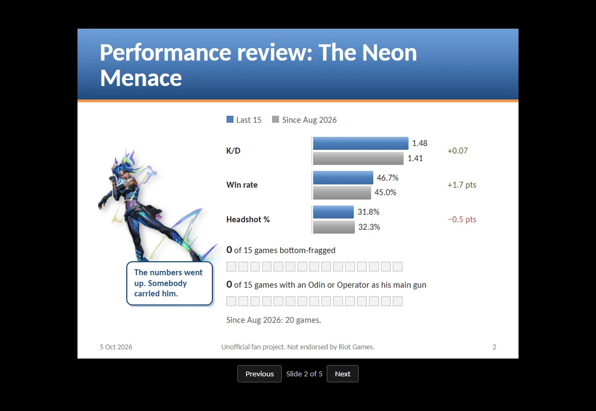
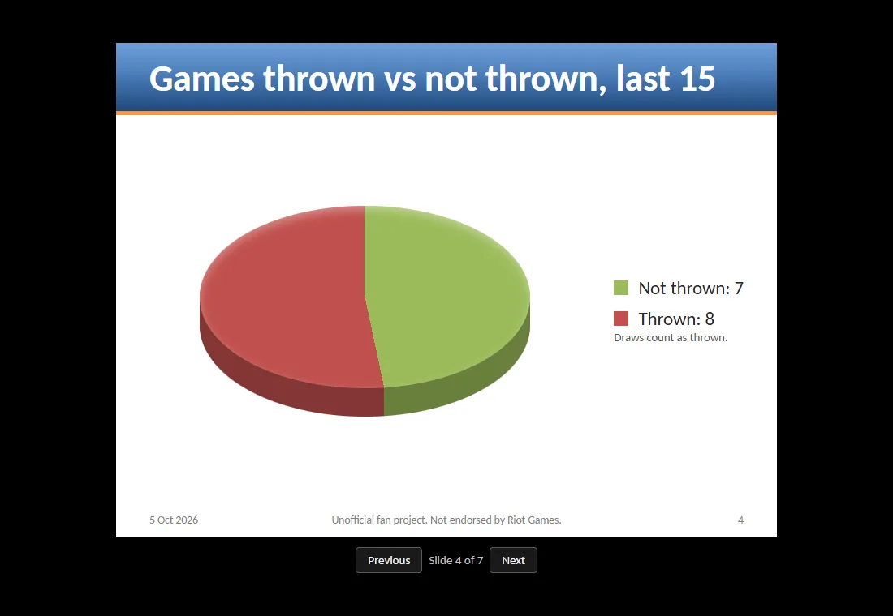
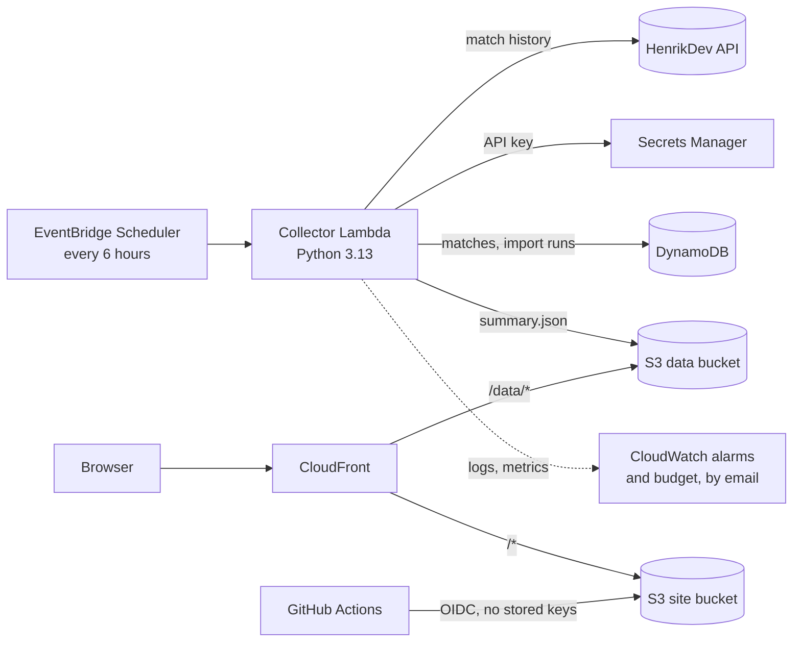

# valorant-stats

A small, deliberately unfair Valorant stats page for a friend group. It presents one
friend's competitive stats as a 2007-era office slide show: a quarterly performance
review whose rating is never positive, whatever the numbers do. The numbers themselves
are real and carefully calculated.


Either answer is correct. A clip-art thumbs-up spins in, a checkerboard transition
reveals the review, and the deck walks through the numbers:

| | |
| --- | --- |
|  |  |
|  | The screenshots use the sample data in `frontend/dev-data/`. |

## How it works



- **Collector:** a Lambda runs every six hours. The first run backfills the player's
  stored match history; later runs fetch the ten most recent matches, which costs two
  API requests. Matches go into DynamoDB, and the collector publishes a precomputed
  `summary.json` (last 15 matches against everything since tracking began).
- **Frontend:** a React and Vite single-page app, served as static files. It reads the
  summary from the same origin, so there is no API server, no CORS, and no
  third-party request: fonts and artwork are bundled.
- **Hosting:** two private S3 buckets behind CloudFront, with HSTS and a strict
  Content Security Policy. There is no VPC, NAT gateway, or database server; it costs
  about $1–2 a month.

### The numbers

| Metric | Calculation |
| --- | --- |
| K/D | Kills divided by deaths, with zero deaths counted as one |
| Win rate | Wins divided by matches; draws count as matches, not wins |
| Headshot % | Headshot hits divided by all hits (head, body, and leg) |

Only completed competitive matches count, and every value comes from summed totals
rather than an average of per-match ratios. Remakes (one round or fewer) are skipped.
Surrenders are scored for the team that didn't surrender, which the round score alone
can't tell, so the collector fetches that match's details.

## Data source

Riot's official API doesn't offer Valorant match data to a private app: a development
key gets `403` on match endpoints, and production keys are for public products. The
collector uses the community-run, unofficial [HenrikDev API](https://docs.henrikdev.xyz)
instead. It may change or stop working, and it isn't endorsed by Riot. Only
`henrikdev.py` and `parse.py` depend on it. The reasoning is in
[the implementation plan](_docs/implementation-plan.md#2-data-source-henrikdev-api).

## Privacy

The repository is public, so nothing personal is committed:

- Real Riot IDs live in the gitignored `config/players.json`; the committed example
  uses placeholders.
- Player photos live in the gitignored `config/photos/` and are uploaded straight to
  the data bucket.
- The collector's test fixtures are real API responses with every Riot ID, PUUID,
  party ID, and match ID replaced (`make capture-fixtures` refuses to write anything
  that still contains one).
- Account IDs, bucket names, and the API key stay in gitignored files, Secrets
  Manager, and GitHub environment secrets.
- `make delete-player PLAYER=<id>` removes everything stored about a player,
  including old versions in the versioned bucket.

## Repository layout

| Path | Contents |
| --- | --- |
| `collector/` | The collector Lambda (`src/collector/`), its tests and fixtures, and dev scripts |
| `frontend/` | The React app; `dev-data/` holds sample summaries for local development |
| `infrastructure/` | Terraform, with a one-time `bootstrap/` for the state bucket |
| `config/` | `players.example.json`; the real `players.json` and `photos/` are gitignored |
| `scripts/` | `deploy-frontend.sh`, used by CI and `make deploy-frontend` |
| `_docs/` | The implementation plan |

## Local development

Requirements (Linux, macOS, or WSL on Windows): GNU Make, Node.js 22.12+ with
Corepack, Python 3.13+ with `venv`, and Terraform 1.16+.

```bash
make dev
```

Open http://127.0.0.1:5173. Vite serves the app and, in development only, the sample
summaries in `frontend/dev-data/` under `/data`, the same path the production app
reads from CloudFront. Add `?player=empty` or `?player=stale` to the URL to preview
those states.

The first slide shows the player's photo from `config/photos/<player-id>.webp`;
without one it falls back to the agent art.

Before pushing, run the same checks as CI:

```bash
make check
```

`make help` lists every target. On WSL with the repository on a Windows drive
(`/mnt/c/...`), keep the Python virtual environment on the Linux filesystem; the tests
run about 100 times faster:

```bash
export VENV=$HOME/.cache/valorant-stats-venv
```

### Real data without AWS

Put a [HenrikDev](https://docs.henrikdev.xyz) API key in `HENRIKDEV_API_KEY`, copy
`config/players.example.json` to `config/players.json` with real Riot IDs, and run:

```bash
make collect-local   # matches and the summary go to the gitignored collector/.local/
make dev LOCAL=1     # serves that summary instead of the sample data
```

## Quality checks

Every pull request runs, and must pass before merging into `main`:

- **Collector:** ruff (lint and format) and pytest, including moto-backed tests of
  DynamoDB, S3, and Secrets Manager, and parsing tests against the captured fixtures.
- **Frontend:** ESLint, TypeScript, Vitest with Testing Library (including the full
  click-through of the deck), the production build, a check that no API key ended up
  in the bundle, and ShellCheck on the deploy script.
- **Infrastructure:** `terraform fmt` and `terraform validate` for both configurations.

Both sides test against the same contract fixture,
`collector/tests/fixtures/summary.expected.json`, so a change to the summary format on
either side fails a test. Dependabot proposes dependency updates monthly.

## Deployment

[`infrastructure/README.md`](infrastructure/README.md) covers the first deployment,
costs, and teardown. In short:

- Merging frontend changes into `main` deploys the site through GitHub Actions,
  assuming an AWS role through OIDC that can only update the site bucket and refresh
  CloudFront's cache.
- Infrastructure and collector changes are applied locally with a reviewed
  `make infra-plan` and `make infra-apply`.

## License

[MIT](LICENSE). The Neon artwork belongs to Riot Games and is used under Riot's
fan-content policy (see [`frontend/src/assets/ASSETS.md`](frontend/src/assets/ASSETS.md));
the bundled fonts are under the SIL Open Font License.

valorant-stats isn't endorsed by Riot Games and doesn't reflect the views or opinions of
Riot Games or anyone officially involved in producing or managing Riot Games
properties. Riot Games and all associated properties are trademarks or registered
trademarks of Riot Games, Inc.
